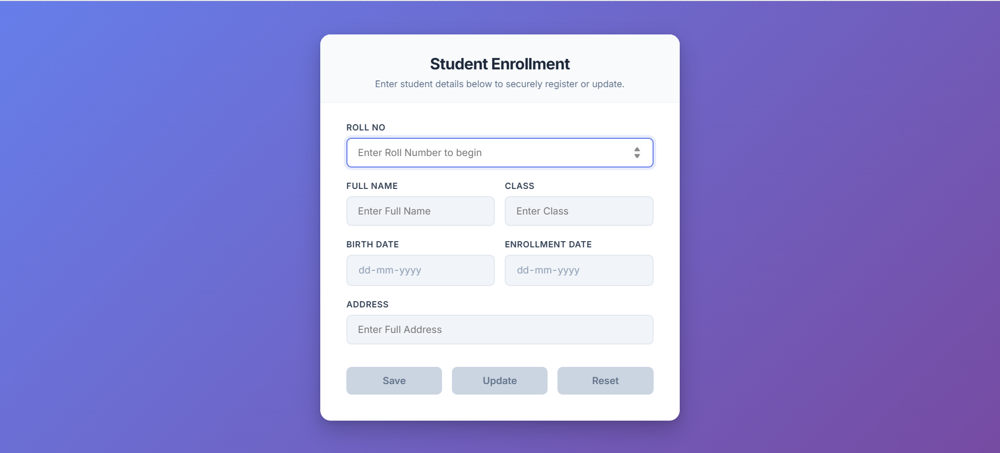

# Student Enrollment Form using JsonPowerDB

## Table of Contents
- [Title of the Project](#student-enrollment-form-using-jsonpowerdb)
- [Description](#description)
- [Illustrations](#illustrations)
- [Benefits of using JsonPowerDB](#benefits-of-using-jsonpowerdb)
- [Scope of Functionalities](#scope-of-functionalities)
- [Examples of use](#examples-of-use)
- [Project Status](#project-status)
- [Sources](#sources)
- [Release History](#release-history)
- [Other Information](#other-information)

## Description
The **Student Enrollment Form** is a full-fledged, web-based UI application functioning as a micro-registration portal. It allows users to register new students and update existing records efficiently using a modern, responsive interface. The backend data operations strictly integrate with **JsonPowerDB** via its API endpoints, bypassing heavy intermediate server-side scripting. It natively demonstrates HTML, CSS (with premium modern flat-design/animations), and JavaScript interacting seamlessly with JPDB's core `IML` and `IRL` protocol endpoints.

## Illustrations

## Benefits of using JsonPowerDB
JsonPowerDB (JPDB) is an advanced and high-performance Database engine combining properties of diverse database paradigms. The core advantages demonstrated in this project include:
- **Serverless API Architecture:** We directly query the database from our front web page securely without building routing middleware or traditional backend servers (NodeJS, PHP, etc.).
- **Minimal Response Times:** Because of its inherent schema-free structure, it exhibits incredibly fast read/write querying speeds, making UI constraints like real-time validation checks highly responsive.
- **Easy Maintenance and Developer-Friendly:** Straightforward endpoint strings utilizing RESTful payloads significantly lower the threshold of relational operations setup.
- **Multi-Mode DB:** Enables storing semi-structured JSON objects natively and querying them efficiently.

## Scope of Functionalities
1. **Validation & Initial Tracking:** Form validates constraints, checks for any empty configurations prior to sending HTTP payloads, and isolates primary index (`Roll No`) during record creation to preserve registry integrity.
2. **Real-time Lookup (Read-IRL):** Inputting a primary key triggers events that intelligently pull down standard database registries identifying if the Record Node already exists.
3. **Data Insertion (Create-IML):** Form maps variables properly tracking new assignments routing to standard `PUT` APIs.
4. **Data Modification (Update-IML):** Dynamically maps pre-filled schema inputs permitting users selective scope editing utilizing native `UPDATE` APIs spanning underlying node instances.
5. **Interactive UI Notifications:** System successes or database errors trigger custom transient visual toast-messages instead of disruptive javascript alerts.

## Examples of use
1. **Entering a Non-Existent Roll Number:**
   - Entering `101` automatically opens all corresponding inputs `Full Name`, `Class`, etc. User fills them conventionally. Hitting `.Save` propagates a PUT payload completing the registry.
2. **Updating Details:**
   - Entering `101` asynchronously recognizes the established Node. Instead of creating a new registry, it maps existing metrics directly resolving into inputs automatically overriding initial `Save` availability with corresponding `.Update` availability.

## Project Status
The project is currently **Stable / Complete** and is documented for primary form enrollment demonstrations spanning standard relational JsonPowerDB CRUD applications logic.

## Sources
- [JsonPowerDB Documentation](http://login2explore.com/workspaces/download/docs/jpdb-api-docs.html) - For API strings encompassing index `IML` & `IRL` formatting.
- [Inter Google Font](https://fonts.google.com/specimen/Inter) - For application UI topography tracking.

## Release History
- **v1.0.0 (Latest Release)** 
  - Standardized Initial base commits launching robust `index.html`, `style.css`, and `script.js` mapping JsonPowerDB environments directly.
  - Re-factored hardcoded native JS prompts utilizing advanced sliding notification toast mechanisms. 
  - Executed Github repository configuration indexing.

## Other Information
- **Database Context Metrics Requirements:**
  - Database Name Framework target: `SCHOOL-DB`
  - Relationship target: `STUDENT-TABLE`
  - Authentication: Modify personalized Secure API Session Token exclusively directly within application JS scripts targeting standard `YOUR_TOKEN_HERE` consts templates.
